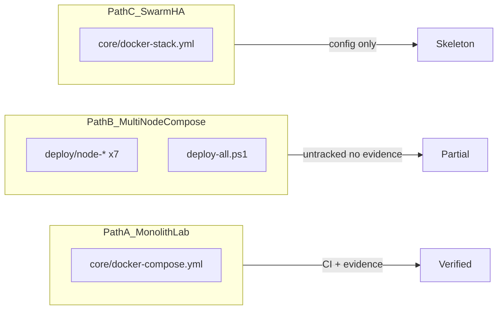

# Bản đồ đường triển khai & đối chiếu cấu hình

**Ngày rà soát:** 2026-05-30  
**Kết quả validate config:** Tất cả `docker compose config` PASS (core + 7 deploy nodes + stack)

## 1. Ba đường triển khai

| Path | File chính | CI validate | Runtime evidence | Trạng thái |
|------|-----------|-------------|------------------|------------|
| **A — Monolith lab** | `core/docker-compose.yml` | `backend-ci.yml` | `docs/evidence/*` (2026-05-26) | **Golden path** |
| **B — Multi-node compose** | `deploy/node-*/docker-compose.yml` | Không | Không | **Partial** (untracked) |
| **C — Swarm HA** | `core/docker-stack.yml` | Không | Không | **Skeleton** |

## 2. Phân bổ service theo node (Path B)

| Node | Project | Services |
|------|---------|----------|
| node-data | shopflow-data | app-db |
| node-security | shopflow-security | redis, opa, vault |
| node-identity | shopflow-identity | keycloak-db, keycloak |
| node-app-a | shopflow-app-a | user-service, order-service |
| node-app-b | shopflow-app-b | billing-service, auth-service |
| node-edge | shopflow-edge | edge-nginx, kong, internal-mtls-proxy, billing-mtls-proxy |
| node-obs | shopflow-obs | loki, promtail, prometheus, grafana |

## 3. Ma trận lệch cấu hình (A vs B vs C)

| Hạng mục | Monolith (A) | Multi-node (B) | Swarm (C) | Mức rủi ro |
|----------|--------------|----------------|-----------|------------|
| billing-mtls-proxy | Có | Có (edge) | **Không** | High |
| internal-mtls-proxy | Có | Có (edge) | Có | OK |
| alertmanager | **Không** | **Không** | Có | Medium |
| redis | Có | Có (security) | Có | OK |
| opa | Có | Có (security) | Có | OK |
| auth-service | Có | Có (app-b) | Có | OK |
| Kong depends_on apps | Có | **Không** | N/A | Medium |
| App depends_on infra | Có (redis/opa/db) | **Không** (retry runtime) | N/A | Medium |
| OPA_ENABLED user-svc | `${OPA_ENABLED:-true}` | `true` | **`false`** | High |
| Keycloak mode | `start-dev`, lax hostname | Giống B | `start`, strict | Medium |
| Network driver | bridge (default) | bridge external | overlay Swarm | Medium |
| Image source | build context | build context | `shopflow/*:latest` prebuilt | High |
| VAULT_REQUIRED billing | `${VAULT_REQUIRED:-false}` | Giống | `"true"` + secret | Medium |

## 4. Phát hiện cụ thể

### 4.1 Path B — Multi-node

- `deploy/create-networks.ps1` comment "overlay" nhưng tạo `driver: bridge` — lệch Swarm overlay.
- `deploy-all.ps1`: chỉ `Wait-Healthy` app-db + redis; Keycloak "proceed anyway".
- Không có bước CI/`verify-final-backend` cho path B.
- **Git:** toàn bộ `deploy/` untracked → reproducibility thấp.

### 4.2 Path C — Swarm stack

- Thiếu `billing-mtls-proxy` → D3 webhook mTLS không deploy được trên stack.
- `user-service` `OPA_ENABLED: "false"` — lệch monolith và kiến trúc OPA rollout.
- Cần Swarm secrets external (`vault_app_token`, `app_db_password`) — chưa có script tạo.
- Image `shopflow/edge-nginx:latest` — không có pipeline build/push trong repo.

### 4.3 Evidence docker-compose-ps (2026-05-26)

Container **thiếu so với monolith đầy đủ:** `redis`, `opa`, `internal-mtls-proxy` không có trong `docs/evidence/docker-compose-ps.txt` dù các service app reference chúng. Cần re-run stack đầy đủ và cập nhật evidence.

## 5. Khuyến nghị canonical path

| Môi trường | Path chuẩn | Lý do |
|------------|-----------|-------|
| Lab / demo / nộp bài | **A** (monolith) | CI + evidence + runbook |
| Demo phân tán logic | **B** (multi-node) | Sau khi commit + gate pass |
| Production HA | **C** (Swarm) | Sau khi bổ sung billing-mtls + build pipeline |

## 6. Hành động đồng bộ hóa (backlog P1)

1. Commit `deploy/` + thêm CI step `docker compose config` cho 7 node.
2. Thêm `billing-mtls-proxy` vào `docker-stack.yml`.
3. Thống nhất `OPA_ENABLED: true` trên user-service (stack).
4. Thêm Alertmanager vào monolith/deploy HOẶC ghi rõ Loki alertmanager_url disabled.
5. Chạy `deploy-all.ps1` + `run-security-checks.ps1` → lưu evidence mới.
