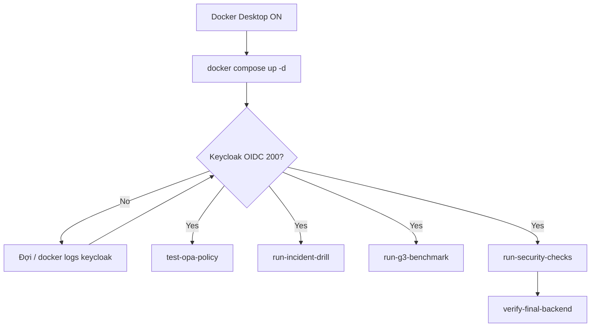

# Runbook vận hành backend ShopFlow

Hướng dẫn lab: **bật gì**, **chạy lệnh gì**, **thứ tự kiểm tra**, và xử lý lỗi thường gặp. Mọi lệnh PowerShell dưới đây giả định **thư mục gốc repo** (`Crypto_Project`), trừ khi ghi rõ `cd core`.

---

## Mục lục

1. [Điều kiện trước khi chạy](#điều-kiện-trước-khi-chạy)
2. [Tài khoản lab](#tài-khoản-lab)
3. [Cài đặt lần đầu](#cài-đặt-lần-đầu)
4. [Khởi động hàng ngày](#khởi-động-hàng-ngày)
5. [Đợi stack sẵn sàng](#đợi-stack-sẵn-sàng)
6. [Kiểm tra theo thứ tự (khuyến nghị)](#kiểm-tra-theo-thứ-tự-khuyến-nghị)
7. [Bảng endpoint & cổng](#bảng-endpoint--cổng)
8. [Production overlay](#production-overlay)
9. [Sự cố thường gặp](#sự-cố-thường-gặp)
10. [DR / backup / rollback](#dr--backup--rollback)
11. [Runbook chuyên sâu](#runbook-chuyên-sâu)

---

## Điều kiện trước khi chạy

### Phần mềm cần bật

| Thành phần | Việc cần làm |
|------------|----------------|
| **Docker Desktop** | Bật và đợi trạng thái *Running* (Windows: tray icon xanh). |
| **PowerShell 5.1+** | Chạy script với `-ExecutionPolicy Bypass` (hoặc `RemoteSigned` cho user hiện tại). |
| **Git** | Chỉ cần khi clone / `verify-final-backend` kiểm tra file tracked. |

Không cần cài Keycloak/Grafana/Prometheus riêng — tất cả chạy trong Docker Compose (`core/docker-compose.yml`).

### Cổng host cần trống (lab)

| Cổng | Dịch vụ |
|------|---------|
| `80`, `443` | Edge nginx (API qua Kong) |
| `8080` | Keycloak |
| `8443` | Billing webhook **mTLS** |
| `9443` | Internal mTLS proxy (S2S lab) |
| `3000` | Grafana |
| `9090` | Prometheus |
| `3100` | Loki |
| `8181` | OPA |
| `8200` | Vault |
| `127.0.0.1:8001` | Kong Admin API (chỉ localhost) |

Nếu cổng bị chiếm (ví dụ app khác dùng `8080`), token Keycloak sẽ fail — đổi port trong compose hoặc tắt process xung đột.

### Biến môi trường lab (tùy chọn)

| Biến | Mặc định | Ghi chú |
|------|----------|---------|
| `KEYCLOAK_TOKEN_URL` | `http://localhost:8080/realms/shopflow/protocol/openid-connect/token` | Override nếu Keycloak không map `8080`. |
| `VALID_TOKEN` | (trống) | Script `fetch-lab-tokens.ps1` tự set sau khi lấy token. |
| `D1_ORDER_PATH` | `/api/orders/order-tenant-b` | Đường BOLA cross-tenant cho D1. |

---

## Tài khoản lab

**Không nhầm** admin Keycloak với user ứng dụng.

### Admin hạ tầng (không gọi API ShopFlow)

| Hệ thống | User | Password | Dùng để |
|----------|------|----------|---------|
| Keycloak Admin Console | `admin` | `admin` | Realm `master`, import/sync client — http://localhost:8080/admin |
| Grafana | `admin` | `admin` | Dashboard — http://localhost:3000 |
| Vault | token trong file local | sau `init-dev.ps1` | `core/vault/.vault-app-token` (runtime), root chỉ admin |

### User realm `shopflow` (API + SPA lab)

| Username | Password | `tenant_id` (JWT) |
|----------|----------|-------------------|
| `tenant-a-user` | `password123` | `tenant-a` |
| `tenant-b-user` | `password123` | `tenant-b` |

- Client OAuth user: **`shopflow-spa`** (password grant + PKCE trên UI).
- Client machine: **`shopflow-s2s`** + secret (xem `core/.env.example`) — grant `client_credentials`, không có username.

---

## Cài đặt lần đầu

```powershell
# 1) Vào thư mục stack
cd core

# 2) Chứng chỉ lab (edge + mTLS client/server)
powershell -ExecutionPolicy Bypass -File .\certs\generate-certs.ps1

# 3) File env runtime (không commit .env)
Copy-Item .env.example .env
# Sau bước Vault: dán VAULT_APP_TOKEN từ vault\.vault-app-token vào .env

# 4) Build & khởi động toàn stack
docker compose build
docker compose up -d

# 5) Vault dev (unseal + policy app) — chạy khi container vault đã listen
powershell -ExecutionPolicy Bypass -File .\vault\init-dev.ps1
# Cập nhật .env: VAULT_APP_TOKEN=<nội dung .vault-app-token>

# 6) (Tuỳ chọn) Đồng bộ client S2S trên realm đang chạy
powershell -ExecutionPolicy Bypass -File .\keycloak\sync-s2s-client.ps1

# 7) Về repo root
cd ..
```

**Lưu ý:** `docker compose up -d` đã gồm `order-service`, `billing-service`, `auth-service`, `user-service` — không cần `up` riêng từng service trừ khi bạn chỉ restart một service sau khi sửa code.

---

## Khởi động hàng ngày

```powershell
# Bật Docker Desktop trước
cd core
docker compose up -d
cd ..
```

Sau đó làm mục [Đợi stack sẵn sàng](#đợi-stack-sẵn-sàng) rồi [Kiểm tra theo thứ tự](#kiểm-tra-theo-thứ-tự-khuyến-nghị).

Dừng stack (giữ data volume):

```powershell
cd core
docker compose down
```

---

## Đợi stack sẵn sàng

Container `keycloak` báo **Started** chưa đủ — JVM + import realm thường cần **30–90 giây**. Chạy benchmark/security ngay sau `up` dễ gặp:

`The underlying connection was closed unexpectedly` tại `fetch-lab-tokens.ps1`.

### Kiểm tra nhanh Keycloak

```powershell
# Phải trả StatusCode 200
Invoke-WebRequest -Uri "http://localhost:8080/realms/shopflow/.well-known/openid-configuration" -UseBasicParsing

# Phải in [OK] VALID_TOKEN...
powershell -ExecutionPolicy Bypass -File .\security\fetch-lab-tokens.ps1
```

### Vòng lặp đợi (copy/paste)

```powershell
$deadline = (Get-Date).AddMinutes(2)
$ok = $false
while ((Get-Date) -lt $deadline -and -not $ok) {
  try {
    Invoke-WebRequest -Uri "http://localhost:8080/realms/shopflow/.well-known/openid-configuration" -UseBasicParsing -TimeoutSec 5 | Out-Null
    $ok = $true
    Write-Host "Keycloak ready"
  } catch {
    Start-Sleep -Seconds 5
    Write-Host "Waiting for Keycloak..."
  }
}
if (-not $ok) { throw "Keycloak not ready — check: docker logs keycloak --tail 50" }
```

### Kiểm tra container

```powershell
cd core
docker compose ps
docker logs keycloak --tail 30
```

Các service quan trọng: `edge-nginx`, `kong`, `keycloak`, `order-service`, `billing-service`, `opa`, `prometheus` — trạng thái **Up** / **healthy** (nếu có healthcheck).

---

## Kiểm tra theo thứ tự (khuyến nghị)

Chạy từ **repo root** (`Crypto_Project`). Thứ tự: phụ thuộc ít → phụ thuộc Keycloak/edge.

| # | Lệnh | Cần gì | Kỳ vọng |
|---|------|--------|---------|
| 1 | `cd core` → `docker compose ps` | Docker | Các container Up |
| 2 | Đợi Keycloak (mục trên) | `:8080` | OIDC config 200 |
| 3 | `powershell -ExecutionPolicy Bypass -File .\security\test-opa-policy.ps1` | OPA `:8181` | `OPA multi-service matrix: PASS` |
| 4 | `powershell -ExecutionPolicy Bypass -File .\metrics\run-incident-drill.ps1 -Runs 3` | Prometheus `:9090` | CSV trong `docs/evidence/` |
| 5 | `powershell -ExecutionPolicy Bypass -File .\metrics\run-g3-benchmark.ps1 -Requests 30 -Runs 2` | Keycloak + edge `:80` | Evidence latency/block-rate |
| 6 | `powershell -ExecutionPolicy Bypass -File .\security\run-security-checks.ps1` | Full stack + certs | `19/19` (hoặc tương đương) PASS, exit `0` |
| 7 | `powershell -ExecutionPolicy Bypass -File .\scripts\verify-final-backend.ps1` | Docker + bước 6 | Static + runtime + layer gate |

### Script bổ sung (từng hạng mục)

```powershell
# Token user lab (tenant-a) — bắt buộc trước nhiều test thủ công
powershell -ExecutionPolicy Bypass -File .\security\fetch-lab-tokens.ps1

# S2S client_credentials
powershell -ExecutionPolicy Bypass -File .\security\test-s2s-client-credentials.ps1

# mTLS nội bộ (dùng docker curl — Windows curl có thể không load PEM)
powershell -ExecutionPolicy Bypass -File .\security\test-internal-mtls.ps1

# Redis consistency (production-oriented)
powershell -ExecutionPolicy Bypass -File .\security\test-redis-consistency.ps1
```

### Security checks — 7 lớp

`security/run-security-checks.ps1` tự gọi `fetch-lab-tokens.ps1`, chạy theo lớp:

1. **Prereq** — token, cert, IdP  
2. **EdgeIngress** — TLS/WAF, cleartext webhook → **403**  
3. **Gateway** — Kong route  
4. **Service** — D1 BOLA, D4 SSRF  
5. **Auth** — D2 expired/refresh  
6. **mTLS** — D3 webhook `:8443`  
7. **Observability** — Prometheus/Loki  

Chi tiết map test case: [`security/layered-checks.md`](../security/layered-checks.md).

Sau khi chạy, đọc:

- `docs/evidence/security-layer-summary.txt` — nếu **Prereq** hoặc **EdgeIngress** `FAIL`, sửa hạ tầng trước khi debug D1–D4.
- `docs/evidence/security-checks-output.txt` — khi chạy qua `verify-final-backend.ps1`.

### Gate checklist gap (tài liệu)

- `implementation/08-production-readiness.md` — production  
- `implementation/09-gap-checklist-pass-fail.md` — 20/20 khi stack lab PASS  

---

## Bảng endpoint & cổng

| Thành phần | URL / cách gọi | Ghi chú |
|------------|----------------|---------|
| API edge (HTTP) | `http://localhost/api/...` | Qua Kong; protected routes cần `Authorization: Bearer <token>` |
| API edge (HTTPS) | `https://localhost/api/...` | TLS lab cert |
| Order list (D1) | `GET http://localhost/api/orders` | Token `tenant-a-user` → 200 |
| BOLA (D1) | `GET http://localhost/api/orders/order-tenant-b` | Token tenant A → **403** |
| Billing public | `GET http://localhost/api/billing/status` | Không cần token (gateway) |
| Webhook D3 | `POST https://localhost:8443/api/billing/webhook` | **mTLS + HMAC** — không gọi qua `:80` |
| Keycloak | http://localhost:8080 | Realm `shopflow` |
| Keycloak Admin | http://localhost:8080/admin | `admin` / `admin` (master) |
| Kong Admin | http://127.0.0.1:8001 | Chỉ localhost |
| OPA | http://localhost:8181 | Policy test |
| Vault | http://localhost:8200 | UI/API dev |
| Grafana | http://localhost:3000 | Dashboard **ShopFlow Research Metrics** |
| Prometheus | http://localhost:9090 | Metrics + alert drill |
| Loki | http://localhost:3100 | Log aggregation |
| Internal mTLS | `https://localhost:9443` | S2S lab proxy |

### Gọi API thủ công (sau `fetch-lab-tokens.ps1`)

```powershell
. .\security\fetch-lab-tokens.ps1
$headers = @{ Authorization = "Bearer $env:VALID_TOKEN" }
Invoke-WebRequest -Uri "http://localhost/api/orders" -Headers $headers -UseBasicParsing
```

---

## Production overlay

Trên máy lab (không thay thế hardening thật ở cloud):

```powershell
cd core
# .env: SHOPFLOW_ENV=production, VAULT_REQUIRED=true, REDIS_URL, VAULT_APP_TOKEN,
#       GF_SECURITY_ADMIN_PASSWORD đổi khỏi mặc định
docker compose -f docker-compose.yml -f docker-compose.prod.yml up -d --build
```

Checklist: `implementation/08-production-readiness.md`

---

## Sự cố thường gặp

### `fetch-lab-tokens` / benchmark: connection closed

- **Nguyên nhân:** Keycloak chưa ready sau `docker compose up`.  
- **Xử lý:** Đợi OIDC `.well-known` trả 200 (mục [Đợi stack sẵn sàng](#đợi-stack-sẵn-sàng)), rồi chạy lại script.

### Docker / script báo không kết nối được

- Bật **Docker Desktop**, `docker info` không lỗi.  
- `cd core` trước khi `docker compose ...`.

### Vault sealed / unhealthy

```powershell
cd core
powershell -ExecutionPolicy Bypass -File .\vault\init-dev.ps1
docker compose restart order-service user-service billing-service auth-service
```

- Runtime services dùng **`VAULT_APP_TOKEN`**, không inject `VAULT_ROOT_TOKEN` vào microservice.

### D1 không trả 403 (BOLA)

- JWT có claim `tenant_id` (realm `core/keycloak/shopflow-realm.json`).  
- Seed DB: `core/db/init.sql` có order `order-tenant-b`.  
- Token mới: `fetch-lab-tokens.ps1` với `tenant-a-user`.

### D3 webhook luôn 401 hoặc fail mTLS

- Gọi **`https://localhost:8443/api/billing/webhook`** (không qua port 80).  
- Chạy lại `core/certs/generate-certs.ps1` nếu thiếu client cert.  
- `HMAC_SECRET` khớp Vault `secret/data/hmac` và `.env`.  
- Header: `X-Signature: sha256=<hex>`, `X-Timestamp`, `X-Nonce` unique.

### Security check fail **Prereq**

- Keycloak Up + `fetch-lab-tokens.ps1` OK.  
- Cert: `core/certs/generate-certs.ps1`.

### Security check fail **EdgeIngress**

- Rebuild edge: `cd core` → `docker compose build edge-nginx` → `docker compose up -d edge-nginx`.  
- Cleartext webhook phải **403** (ModSecurity rule 900010).

### JWT 401 từ service

- `iss` trong token khớp `KEYCLOAK_ISSUERS` (`http://localhost:8080/realms/shopflow` hoặc hostname `keycloak` trong Docker network).  
- Lấy token mới, không dùng token cũ sau khi restart Keycloak.

### S2S `invalid_scope`

- Chạy `core/keycloak/sync-s2s-client.ps1` sau khi Keycloak ready.  
- Lab enforce qua audience/client mapper — xem `services/shared/m2m-auth.js`.

### OPA PASS nhưng API vẫn sai

- OPA test gọi trực tiếp policy bundle; API còn Kong + service PEP — debug theo layer **Gateway** / **Service** trong `run-security-checks.ps1`.

### Prometheus/Loki fail (Observability layer)

```powershell
cd core
docker compose ps prometheus loki
docker compose restart prometheus loki
```

---

## DR / backup / rollback

### Backup

| Tài sản | Cách |
|---------|------|
| PostgreSQL app | Snapshot volume `app-db-data` |
| Vault | Volume `vault-data` + unseal keys **ngoài repo** |
| Keycloak realm | Export `shopflow` định kỳ; file seed `core/keycloak/shopflow-realm.json` |

### Rollback release

1. `docker compose pull` image tag trước (hoặc build tag cũ).  
2. `cd core` → `docker compose up -d` với tag cũ.  
3. Đợi Keycloak ready → `powershell -ExecutionPolicy Bypass -File ..\security\run-security-checks.ps1` từ repo root.

---

## Runbook chuyên sâu

| Chủ đề | File |
|--------|------|
| PKCE / client onboarding | [docs/runbook/client-onboarding.md](runbook/client-onboarding.md) |
| Key rotation | [docs/runbook/key-rotation.md](runbook/key-rotation.md) |
| Token revocation | [docs/runbook/token-revocation.md](runbook/token-revocation.md) |
| Incident + MTTD/MTTR | [docs/runbook/incident-response.md](runbook/incident-response.md) |
| Trade-off security/perf/cost | [docs/trade-off-security-performance-cost.md](trade-off-security-performance-cost.md) |

### CI security gate (không cần Docker local)

Trên Linux runner: `ci/run-security-gate.sh` — workflow `.github/workflows/security-pr.yml`, `security-nightly.yml`.

### Grafana / metrics nghiên cứu

- Dashboard: **ShopFlow Research Metrics** (p95, block-rate).  
- Recording rules: `core/observability/recording_rules.yml`.  
- Evidence benchmark: `docs/evidence/g3-benchmark-*.csv`, `mttd-mttr-drill-*.csv`.

---

## Sơ đồ phụ thuộc nhanh


