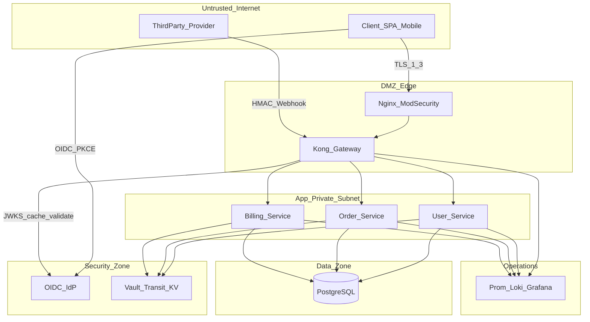
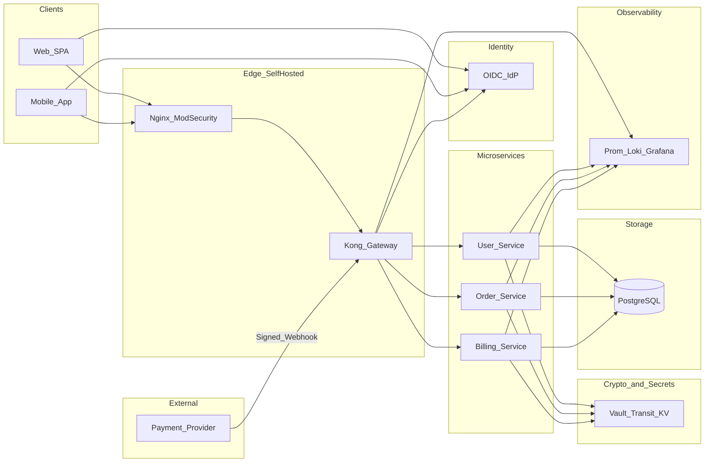
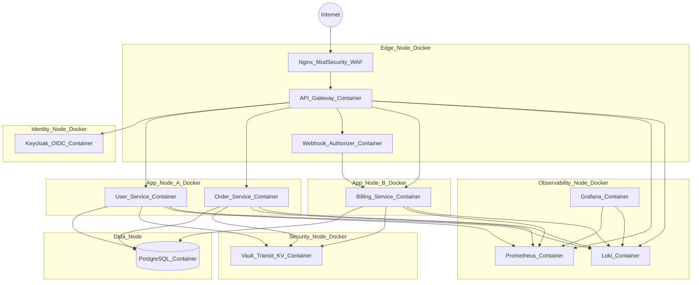
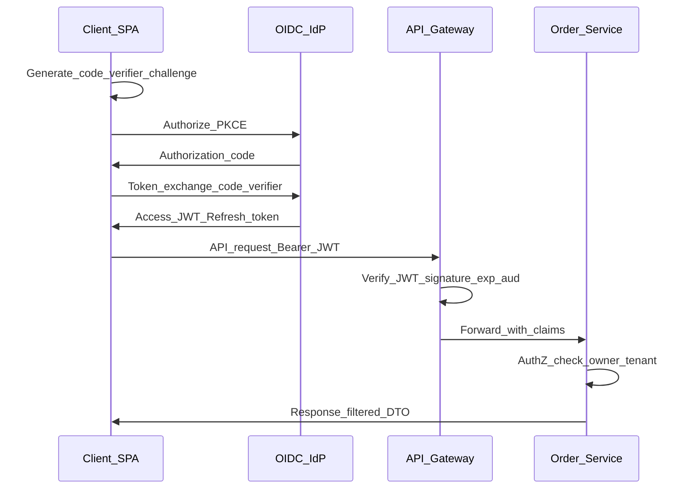
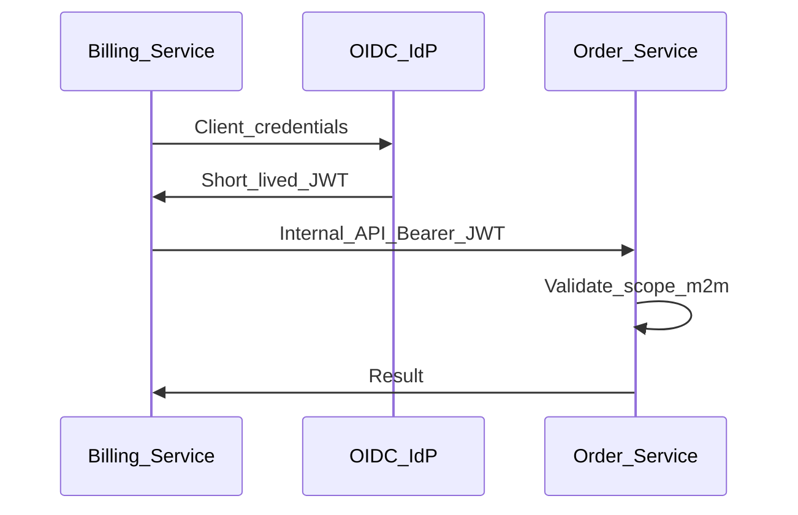
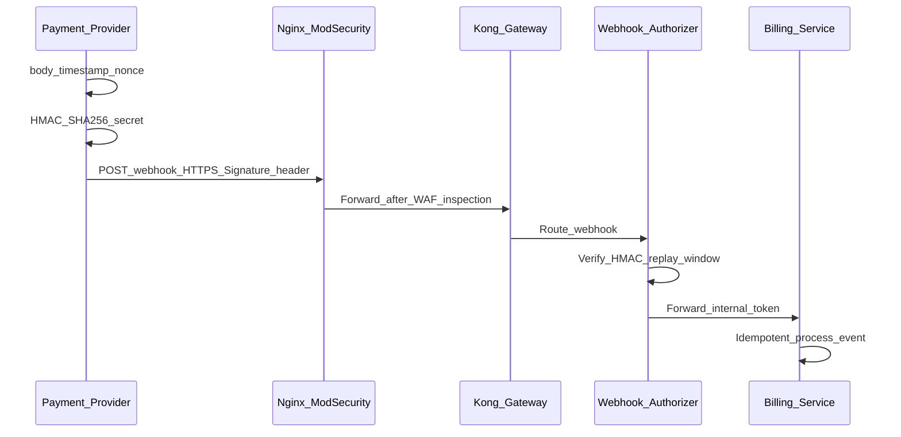
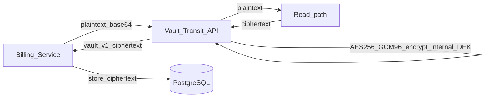

# Kiến trúc hệ thống đề xuất — Bảo mật API Cloud cho SME

**Môn:** NT219 — Cryptography  
**Đề tài:** Cloud API‑Based Network Application Security for Small Company Services  
**Phạm vi kiến trúc:** Single-region startup, Docker phân tán đa node, self-host 100% (không chi phí dịch vụ ngoài)  
**Trạng thái:** Tài liệu kiến trúc chuẩn (canonical, chưa triển khai code)

---

## 0. Baseline review checklist (H/M/L)

| Mức | Hạng mục kiểm tra | Trạng thái | Ghi chú |
|-----|--------------------|------------|--------|
| High | OAuth/OIDC chỉ dùng Authorization Code + PKCE | Đạt | Không dùng implicit flow |
| High | JWT lifecycle rõ TTL, refresh rotation, revocation strategy | Đạt | Thêm mục vòng đời token |
| High | Webhook HMAC + anti-replay có nơi verify khả thi | Đạt | Verify tại custom authorizer/Billing ingress |
| High | Mapping NT219 đúng mục (Goals/Demo/References) | Đạt | Sửa mục 8.1 |
| Medium | Đồng bộ authZ giữa các tài liệu (không chồng PDP/OPA) | Đạt | AuthZ server-side tại service; OPA runtime không dùng |
| Medium | OWASP API Top 10 mapping đầy đủ | Đạt | Bổ sung bảng đầy đủ 10 hạng mục |
| Medium | Có protocol kiểm chứng G3 đo được | Đạt | Thêm protocol D1-D4 |
| Low | Diễn đạt, thuật ngữ, tham chiếu nội bộ | Đạt | Rà cuối tài liệu |

---

## 1. Bối cảnh (Scenario)

### 1.1. Mô tả tổ chức

**ShopFlow** là công ty SaaS B2B quy mô nhỏ (~25 nhân sự), cung cấp nền tảng quản lý đơn hàng và thanh toán cho các cửa hàng bán lẻ. Khách hàng truy cập qua web (SPA) và mobile app; đối tác thanh toán và vận chuyển tích hợp qua REST API và webhook.

Đặc điểm vận hành SME:

| Yếu tố | Thực tế |
|--------|---------|
| Nhân sự an ninh | Không có SOC riêng; DevOps kiêm nhiệm bảo mật cơ bản |
| Ngân sách | Không phát sinh chi phí dịch vụ ngoài; ưu tiên OSS self-host |
| Phụ thuộc API | Toàn bộ nghiệp vụ đi qua API; lộ token/API key gây thiệt hại uy tín và pháp lý |
| Tuân thủ | Cần bảo vệ PII khách hàng, log kiểm toán, có khả năng phản ứng sự cố |

### 1.2. Vấn đề cần giải quyết

- Mặt phẳng API là điểm tấn công chính (OWASP API Top 10: BOLA, broken auth, excessive exposure).
- Thiếu phân tầng mạng và kiểm soát tập trung tại edge.
- Secret/token có nguy cơ lưu trữ không an toàn hoặc sống quá lâu.
- Cần giải pháp **cân bằng an toàn – chi phí – vận hành** cho startup single-region.

### 1.3. Giả định triển khai

- Một môi trường lab/on-prem một region logic với mạng private giữa các node.
- Edge: Nginx + ModSecurity WAF; Kong OSS Gateway chạy container ở edge node.
- Compute: microservice chạy container Docker trên nhiều node tách biệt (không dồn 1 cụm).
- IdP: Keycloak container trên identity node.
- Khóa và secret: Vault OSS (Transit + KV).
- Quan sát: Prometheus + Loki + Grafana.

---

## 2. Các bên liên quan (Related Entities)

| Thực thể | Vai trò | Tương tác với hệ thống |
|----------|---------|------------------------|
| **End User** (chủ cửa hàng) | Người dùng cuối SPA/mobile | Đăng nhập OIDC (Authorization Code + PKCE), gọi API với access token |
| **Tenant Admin** | Quản trị tài khoản tenant | RBAC cao hơn; truy cập API admin, audit log |
| **Internal Developer** | Phát triển, bảo trì API | CI/CD, không truy cập production secret trực tiếp |
| **DevOps / SecOps** | Triển khai, giám sát, IR | IaC, rotation key, xem alert, runbook sự cố |
| **Third-party Provider** | Cổng thanh toán, logistics | Webhook HMAC-signed; IP allowlist; client credentials S2S |
| **Platform Owner (Lab/On-prem)** | Hạ tầng tự vận hành | Reverse proxy/WAF, gateway, Vault, PostgreSQL, observability |
| **Auditor / Giảng viên** | Đánh giá đồ án | Kiểm tra threat model, demo tấn công/phòng thủ trong lab |

### Ma trận quan tâm bảo mật (rút gọn)

| Thực thể | Confidentiality | Integrity | Availability |
|----------|-------------------|-----------|--------------|
| End User | Cao (dữ liệu riêng) | Cao | Trung bình |
| Tenant Admin | Cao | Rất cao | Cao |
| Third-party | Trung bình (chỉ webhook scope) | Rất cao | Trung bình |
| DevOps | Cao (secrets) | Cao | Cao |
| ShopFlow (doanh nghiệp) | Rất cao | Rất cao | Cao |

---

## 3. Tài sản và yêu cầu bảo mật (Assets & Security Requirements)

### 3.1. Tài sản thông tin

| ID | Tài sản | Phân loại | Mức nhạy cảm |
|----|---------|-----------|--------------|
| A1 | PII khách hàng (tên, email, SĐT) | Dữ liệu nghiệp vụ | Cao |
| A2 | Dữ liệu đơn hàng, thanh toán | Dữ liệu nghiệp vụ | Rất cao |
| A3 | Access token / Refresh token (JWT) | Tài sản mật mã | Rất cao |
| A4 | API key / Client secret (S2S) | Tài sản mật mã | Rất cao |
| A5 | Khóa ký webhook (HMAC secret) | Tài sản mật mã | Rất cao |
| A6 | Master key / DEK (Vault Transit) | Tài sản mật mã | Rất cao |
| A7 | Chứng chỉ TLS / mTLS | Tài sản mật mã | Cao |
| A8 | Log audit, trace ID | Vận hành / tuân thủ | Trung bình–cao |
| A9 | Cấu hình IaC, policy authorization | Cấu hình hệ thống | Cao |
| A10 | Metadata cloud (IMDS) | Hạ tầng | Cao (nếu SSRF) |

### 3.2. Yêu cầu bảo mật theo CIA

**Confidentiality (bảo mật)**

- Mọi traffic client ↔ edge ↔ API: **TLS 1.2+** (ưu tiên TLS 1.3).
- Token ngắn hạn; refresh token rotation; không lưu secret trong repo.
- Dữ liệu nhạy cảm at-rest: **envelope encryption** qua Vault Transit (AES-256).
- Phân quyền theo tenant và object (chống BOLA).

**Integrity (toàn vẹn)**

- JWT ký bằng **asymmetric** (RS256/ES256); gateway validate chữ ký và `exp`, `aud`, `iss`.
- Webhook: **HMAC-SHA256** + timestamp + nonce chống replay.
- Artifact CI/CD: ký release (tùy chọn mở rộng cuối kỳ).

**Availability (sẵn sàng)**

- Rate limiting tại Kong Gateway và WAF.
- Health check, backup định kỳ cho PostgreSQL; backoff khi IdP chậm.
- Giám sát spike failed auth / 4xx / 5xx.

### 3.3. Yêu cầu bổ sung (phục vụ đồ án NT219)

| Mã | Yêu cầu | Liên kết môn học |
|----|---------|------------------|
| SR1 | Xác thực OAuth2/OIDC + PKCE cho public client | G1 — giao thức bảo mật |
| SR2 | Authorization server-side (RBAC/scope) | G2 — toàn vẹn truy cập |
| SR3 | Bảo vệ S2S: client credentials hoặc mTLS | G1 — mTLS, PKI |
| SR4 | Quản lý vòng đời khóa (Vault Transit, rotation) | G1 — quản lý khóa |
| SR5 | Phát hiện và ghi nhận tấn công mô phỏng | G3 — kiểm chứng |
| SR6 | Tài liệu threat model + mapping OWASP API Top 10 | G2, G3 |

---

## 4. Vai trò các node mạng (Network Nodes)

> **Nguyên tắc:** Nêu rõ vai trò từng node **trước** khi triển khai. Mỗi node thuộc một **trust zone**; chỉ giao tiếp qua kênh đã định nghĩa.

### 4.1. Bảng vai trò node

| Node | Trust zone | Vai trò chính | Giao thức / cổng điển hình |
|------|------------|---------------|----------------------------|
| **Client (SPA/Mobile)** | Untrusted (Internet) | Hiển thị UI; public client dùng Authorization Code + PKCE; access token lưu ngắn hạn trong memory; không tin dữ liệu phía client | HTTPS → Nginx WAF |
| **Nginx + ModSecurity WAF** | DMZ / Edge | Terminate TLS; lọc OWASP rules; rate limit; chặn scan hàng loạt | HTTPS 443 |
| **Kong OSS Gateway** | DMZ → App | Single entry API; validate JWT; throttle; routing; request validation (OpenAPI); inject correlation ID | HTTPS private network |
| **OIDC IdP (Keycloak)** | Security zone | Realm/users; OIDC; phát access/refresh token; client registry | HTTPS, OAuth2/OIDC |
| **User Service** | App private subnet | CRUD profile; enforce ownership tenant/user | HTTPS private network |
| **Order Service** | App private subnet | CRUD đơn hàng; **server-side authz** chống BOLA | HTTPS |
| **Billing Service** | App private subnet | Thanh toán, hóa đơn; dữ liệu nhạy cảm | HTTPS |
| **Vault OSS (Transit + KV)** | Security zone | Master key transit; lưu API key/HMAC secret; rotation | HTTPS private network |
| **PostgreSQL** | Data zone | Persistence; encryption at-rest; không public | 5432 (private network) |
| **Prometheus + Loki + Grafana** | Ops zone | Log JSON; metric; alert failed auth, rate spike | HTTPS/GRPC private network |
| **Third-party** | External | Gửi webhook đã ký; nhận callback có kiểm soát | HTTPS + HMAC header |
| **CI Runner (self-host)** | Dev zone | Build, scan, deploy nội bộ; không giữ secret lâu dài | Private runner network |

### 4.2. Trust boundaries

**Quy tắc ranh giới:**

1. **Internet → DMZ:** Chỉ 443; WAF bắt buộc; không expose PostgreSQL/IdP admin ra public.
2. **DMZ → App:** JWT đã validate; header `X-Correlation-Id` bắt buộc; firewall deny-by-default.
3. **App → Data:** Chỉ allowlist từ service network; credential DB từ Vault KV.
4. **App/Edge → Vault:** Policy least privilege theo từng service identity.
5. **External → Webhook endpoint:** HMAC + timestamp window + (tùy chọn) IP allowlist.

---

## 5. Kiến trúc hệ thống đề xuất

> **PlantUML:** các sơ đồ tương đương nằm trong [`Kien-truc-he-thong-NT219.puml`](Kien-truc-he-thong-NT219.puml). Xem tại [plantuml.com/plantuml](https://www.plantuml.com/plantuml/uml/) hoặc extension PlantUML trong VS Code/Cursor.

### 5.1. Sơ đồ tổng thể (logical)

### 5.2. Sơ đồ triển khai vật lý (Docker phân tán, single-region)

### 5.3. Luồng 1 — Đăng nhập OIDC (Authorization Code + PKCE)

**Điểm mật mã:** PKCE chống intercept authorization code; JWT ký asymmetric; access token TTL ngắn (5–15 phút).

### 5.4. Luồng 2 — Service-to-service (Client Credentials)

**Điểm mật mã:** Client secret trong Vault KV; JWT ngắn hạn; mTLS là hướng tăng cứng S2S khi nhóm đủ thời gian lab.

### 5.5. Luồng 3 — Webhook có chữ ký (HMAC)

**Điểm mật mã:** HMAC-SHA256 (Vault KV `secret/data/hmac`); replay `timestamp` + `nonce` Redis; constant-time compare. mTLS qua `billing-mtls-proxy:8443`.

> **Runtime:** `services/webhook-authorizer` (edge node) → `POST /api/internal/billing/webhook` trên billing-service (shared `WEBHOOK_INTERNAL_SECRET`).

### 5.6. Luồng 4 — Mã hóa dữ liệu at-rest (Vault Transit Encryption-as-a-Service)

**Điểm mật mã:** Vault Transit engine dùng key `shopflow-master` (AES-256-GCM / aes256-gcm96); master key lưu trong Vault, không bao giờ expose cho ứng dụng; ciphertext có format `vault:v1:...`. Đây là pattern **Encryption-as-a-Service** — service gọi Vault API thay vì tự quản lý DEK.

> **Về "Envelope Encryption":** Vault Transit nội bộ sử dụng 2-level key hierarchy (DEK + KEK) nhưng ứng dụng không cần biết chi tiết. Từ góc nhìn kiến trúc, đây là envelope encryption với Vault làm KMS — đúng với G1 (Vault Transit, AES-256, quản lý vòng đời khóa).

> **Demo D5:** `POST /api/billing/vault-encrypt` và `/api/billing/vault-decrypt` (billing-service) minh chứng luồng mã hóa/giải mã qua Vault Transit. Key rotation có thể thực hiện qua `vault write -f transit/keys/shopflow-master/rotate`.

### 5.7. Vòng đời token và revocation strategy

| Thành phần | Chính sách |
|------------|------------|
| Access token | TTL 5-15 phút; gateway validate `iss`, `aud`, `exp`, chữ ký JWS |
| Refresh token | Rotation bật ở IdP; phát hiện reuse thì thu hồi session |
| Revocation | Không giả định revoke tức thì cho access token stateless; dùng TTL ngắn + denylist ngắn hạn cho sự cố khẩn |
| Key rotation | JWKS rotation định kỳ; gateway cache JWKS theo TTL |

---

## 6. Ánh xạ lý thuyết mật mã học cơ bản

| Vùng kiến trúc | Cơ chế | Lý thuyết / chuẩn | Mục đích trong đề tài |
|----------------|--------|-------------------|------------------------|
| Edge (Client ↔ Nginx WAF) | TLS 1.3, HSTS | PKI, handshake, cipher suite | Bảo mật kênh, chống MITM |
| API Gateway | JWT validation (JWS) | RSA/ECDSA, RFC 7519/7515 | Toàn vẹn và xác thực token |
| IdP (Keycloak) | OIDC, PKCE, refresh rotation | OAuth2 RFC 6749, OIDC | Chống đánh cắp code/token |
| S2S | Client Credentials JWT / mTLS | PKI, certificate binding | Tin cậy giữa microservice |
| Webhook | HMAC-SHA256 | MAC, shared secret | Toàn vẹn callback, chống giả mạo |
| Storage | Vault Transit Encryption-as-a-Service (aes256-gcm96) | Symmetric crypto (AES-GCM), 2-level key hierarchy in Vault | Bảo mật dữ liệu at-rest; key không bao giờ expose cho app |
| Chống replay | `nonce` + timestamp window | Replay attack | Áp dụng webhook và API nhạy cảm |
| Key lifecycle | Rotation, revocation | Key management | Giảm thiệt hại khi lộ khóa |

### Bảng đối chiếu vectơ tấn công ↔ biện pháp mật mã

| Vectơ (OWASP API 2023) | Biện pháp kiến trúc | Cơ chế mật mã / giao thức |
|------------------------|----------------------|---------------------------|
| API1 BOLA | AuthZ server-side + ABAC (tenant_id) + RBAC admin | JWT claims + `services/shared/authz.js` |
| API2 Broken Authentication | PKCE, token ngắn, refresh rotation | OIDC, JWS |
| API3 Broken Object Property Level Authorization | Field-level authz, DTO whitelist | Policy + schema contract |
| API4 Unrestricted Resource Consumption | Quota, rate-limit đa tầng | Gateway/WAF policy |
| API5 Broken Function Level Authorization | RBAC (role trong JWT) + ABAC (tenant_id) | JWT `realm_access.roles` + server-side checks |
| API6 Unrestricted Access to Sensitive Business Flows | Step-up auth, anti-automation | OIDC + risk control |
| API7 SSRF | Egress deny metadata IP; URL allowlist | Network + input validation |
| API8 Security Misconfiguration | IaC baseline, deny-by-default, hardening headers | Chính sách hạ tầng |
| API9 Improper Inventory Management | Versioning, API inventory, deprecate policy | Governance |
| API10 Unsafe Consumption of APIs | Schema validation, timeout/retry/circuit-breaker | TLS + contract validation |

---

## 7. Threat model tóm tắt (STRIDE)

| Threat | Mô tả | Node liên quan | Kiểm soát đề xuất |
|--------|-------|----------------|-------------------|
| Spoofing | Giả client/API | Gateway, IdP | JWT, PKCE, mTLS (S2S) |
| Tampering | Sửa request/webhook | Edge, Billing | TLS, HMAC |
| Repudiation | Chối giao dịch | Toàn hệ thống | Audit log + correlation ID |
| Information disclosure | Lộ PII, token | DB, Client | Vault Transit, TLS, least privilege |
| Denial of Service | Flood API | Edge | WAF, rate limit |
| Elevation of privilege | BOLA, scope abuse | Order/User svc | Server-side authZ |

---

## 8. Liên kết yêu cầu NT219 (trình bày đồ án)

### 8.1. Báo cáo giữa kỳ — mapping nội dung

| Mục NT219 bắt buộc | Vị trí trong tài liệu này |
|--------------------|---------------------------|
| Project topics | Tiêu đề + mục 1 |
| Scenario | Mục 1 — ShopFlow SME |
| Related entities & security requirements | Mục 2, 3 |
| References | Mục 9 + mục 13 |
| Literature survey sketch | Mục 9 |
| Goals | Mục 8.2 |
| Demonstration proposal | Mục 10 |

### 8.2. Mục tiêu dự án (Goals)

1. **G1:** Chứng minh áp dụng TLS, JWT/JWS, HMAC, Vault Transit vào kiến trúc API thực tế.
2. **G2:** Đáp ứng CIA và yêu cầu SR1–SR6 cho bối cảnh SME.
3. **G3:** Mô phỏng tấn công (BOLA, token replay, webhook forgery, SSRF) và đo hiệu quả phòng thủ trên lab.

### 8.3. Chuẩn đầu ra đồ án

| Chuẩn | Nội dung kiến trúc đáp ứng |
|-------|----------------------------|
| G1 | Mục 6 — ánh xạ thuật toán/giao thức |
| G2 | Mục 3 — CIA, SR1–SR6 |
| G3 | Mục 10 và 10.1 — kịch bản kiểm chứng (sau này gắn demo) |

---

## 9. Khảo sát tài liệu (Literature Sketch)

**Chuẩn / hướng dẫn (≥5):**

- OWASP API Security Top 10
- RFC 6749 (OAuth 2.0), RFC 7636 (PKCE), OpenID Connect Core
- RFC 7519 (JWT), RFC 7515 (JWS)
- NIST SP 800-57 (Key Management), NIST SP 800-52 (TLS)

**Stack tham chiếu (≥3):**

- Kong OSS Gateway + Nginx/ModSecurity WAF + Vault OSS
- Keycloak (OIDC IdP self-host)
- OWASP ZAP (kiểm thử sau triển khai)

**Bài báo mới (mẫu tối thiểu theo NT219):**

- [ ] Paper 2020+ liên quan trực tiếp API security cho cloud/microservices (điền DOI/venue, tóm tắt 5-7 dòng, và mapping vào D1-D4).

---

## 10. Đề xuất demo (Demonstration Proposal) — phạm vi kiến trúc

Đã triển khai hạ tầng lab và ưu tiên hoàn thiện demo kiểm chứng theo kiến trúc trên.

| # | Kịch bản | Mục tiêu kiểm chứng | Chỉ số |
|---|----------|---------------------|--------|
| D1 | BOLA — đổi `order_id` trên API | AuthZ server-side chặn truy cập chéo tenant | 100% request trái phép → 403 |
| D2 | Replay access token hết hạn / bị denylist | TTL + denylist + refresh rotation | Token cũ bị từ chối |
| D3 | Webhook giả không có HMAC | Gateway từ chối trước khi vào Billing | 100% forged → 401 |
| D4 | SSRF qua endpoint fetch URL | Không truy cập 169.254.169.254 | Request bị chặn |

**Chỉ số đánh giá kiến trúc (khi có lab):** tỷ lệ tấn công bị chặn, MTTD từ Prometheus alert, độ trễ p95 qua Gateway+WAF, chi phí dịch vụ ngoài = 0.

### 10.1. Protocol kiểm chứng G3 (lab)

| Bước | Cách chạy | Dữ liệu thu |
|------|-----------|-------------|
| Baseline | Chạy test D1-D4 khi chưa bật đầy đủ policy | tỷ lệ request lọt, p95 |
| Hardened | Bật authz server-side, rate-limit, HMAC verify, egress filter | tỷ lệ request bị chặn, mã lỗi |
| So sánh | So baseline vs hardened theo từng D1-D4 | % giảm request tấn công thành công |
| Chứng cứ | Lưu log Loki/Grafana + screenshot + script test | file minh chứng cho báo cáo |

---

## 11. Lý do chọn kiến trúc cho SME

| Lựa chọn | Lợi ích SME | Trade-off |
|----------|-------------|-----------|
| Kong OSS + Nginx/ModSecurity | Không phí dịch vụ ngoài, policy tập trung | Cần tự vận hành và tuning rule |
| Keycloak container | Linh hoạt khi triển khai Docker phân tán | Tăng effort vận hành IdP |
| Vault OSS (Transit + KV) | Key management/self-host secret không tốn phí SaaS | Cần backup, unseal và rotation đúng quy trình |
| Docker đa node (Compose theo node) | Không dồn dịch vụ vào 1 cụm, cô lập lỗi tốt hơn | Cần quản lý mạng liên node và quan sát tập trung |
| Single-region | Đơn giản, rẻ | Không HA đa region |

---

## 12. Phạm vi ngoài giai đoạn hiện tại

- Triển khai IaC, repository microservice, pipeline CI/CD.
- Chạy OWASP ZAP / pentest tự động.
- Multi-tenant isolation nâng cao (per-tenant DEK qua Vault Transit) — mở rộng tùy chọn cuối kỳ.

---

## 13. References

- OWASP API Security Top 10 (2023)
- RFC 6749 (OAuth 2.0), RFC 7636 (PKCE), OpenID Connect Core
- RFC 7519 (JWT), RFC 7515 (JWS)
- NIST SP 800-57 (Key Management), NIST SP 800-52 (TLS)
- NIST SP 800-207 (Zero Trust Architecture)

---

## Phụ lục — Checklist NT219 (kiến trúc)

- [x] Scenario rõ ràng (SME ShopFlow)
- [x] Related entities + security requirements (CIA, SR1–SR6)
- [x] Vai trò từng node mạng + trust boundaries
- [x] Sơ đồ kiến trúc + luồng chính
- [x] Ánh xạ lý thuyết mật mã cơ bản
- [x] Literature sketch + goals + demo proposal (khung)
- [ ] ≥1 bài báo mới (bổ sung khi khảo sát)
- [ ] Triển khai code/demo (giai đoạn sau)

---

*Tài liệu phục vụ đồ án NT219 — giai đoạn thiết kế kiến trúc. Cập nhật khi chốt stack chi tiết (Kong/Keycloak/Vault, topology Docker đa node).*
