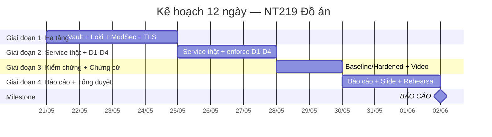

# 🎯 Kế hoạch 2 tuần hoàn thành Xuất sắc Đồ án NT219

**Đề tài:** Cloud API-Based Network Application Security for Small Company Services  
**Ngày bắt đầu:** 21/05/2026 (Thứ Tư)  
**Ngày báo cáo:** 02/06/2026 (Thứ Hai) — **12 ngày làm việc**  
**Mục tiêu:** Đạt **Distinction** ở cả 3 phần chấm (Final Presentation 33% + Final Report 33% + Code/Demo 33%)

---

## 📊 Trạng thái hiện tại (21/05)

### ✅ Đã hoàn thành
- Kiến trúc chuẩn canonical đầy đủ ([Kien-truc-he-thong-NT219.md](file:///d:/Study/HK4/MMH/Projects/Duan/NT219.Q22.ANTT/docs/Kien-truc-he-thong-NT219.md))
- Docker Compose skeleton: Nginx + Kong + Keycloak + Prometheus + Grafana + 3 mock services
- Test script D1-D4 ([run-security-checks.ps1](file:///d:/Study/HK4/MMH/Projects/Duan/NT219.Q22.ANTT/security/run-security-checks.ps1))
- Báo cáo baseline/hardened sơ bộ
- Slide outline, demo runbook, submission checklist

### ⚠️ Thiếu — phải hoàn thành để đạt Distinction

| # | Hạng mục thiếu | Mức quan trọng | Vì sao cần |
|---|----------------|---------------|------------|
| 1 | **Service thật** (thay echo-server mock) | 🔴 Critical | Rubric: "code chạy tốt", D1-D4 cần enforce thật |
| 2 | **Vault OSS** (Transit + KV) | 🔴 Critical | SR4 (quản lý khóa), G1 (mật mã) |
| 3 | **Loki** + log pipeline | 🟡 High | Observability, chứng cứ G3 |
| 4 | **ModSecurity WAF** | 🟡 High | WAF theo kiến trúc canonical |
| 5 | **TLS/mTLS** | 🟡 High | G1, SR3 |
| 6 | **Bài báo mới** (≥1 paper 2020+) | 🔴 Critical | Bắt buộc theo đề cương |
| 7 | **Báo cáo viết** (Word/PDF) | 🔴 Critical | 33% điểm |
| 8 | **Slide thuyết trình** | 🔴 Critical | 33% điểm |
| 9 | **Video demo backup** | 🟡 High | Backup khi lỗi demo live |

---

## 👥 Phân vai thành viên

| Vai trò chính | Thành viên | Thế mạnh giao |
|--------------|-----------|---------------|
| **TV1** — Nguyễn Tấn Danh | Security Lead + Backend | Vault, Token lifecycle, HMAC, D2/D3 code |
| **TV2** — Nguyễn Thị Tuyết Nhi | Infrastructure Lead + Docs | WAF, Loki, TLS, Báo cáo viết, Literature |
| **TV3** — Nguyễn Quốc Trường | Service Lead + Demo | Service thật (Order/User/Billing), D1/D4 code, Slide, Demo |

---

## 📅 Timeline tổng thể

---

## 🔥 Giai đoạn 1: Củng cố hạ tầng (21/05 → 24/05)

> **Mục tiêu:** Stack đầy đủ theo kiến trúc canonical — Vault, Loki, ModSecurity, TLS — docker compose up chạy ổn.

---

### 📋 TASK 1.1 — Thêm Vault OSS vào stack
| | Chi tiết |
|---|---------|
| **Người thực hiện** | **TV1 (Danh)** |
| **Mô tả** | Bổ sung HashiCorp Vault (dev mode) vào docker-compose. Tạo path KV cho secrets (jwt-key, hmac-secret, db-credentials). Tạo Transit key cho envelope encryption. |
| **Chỉ dẫn hoàn thành** | 1. Thêm service `vault` vào [docker-compose.yml](file:///d:/Study/HK4/MMH/Projects/Duan/NT219.Q22.ANTT/core/docker-compose.yml) (image `hashicorp/vault:1.17`, port 8200, dev mode). 2. Tạo thư mục `core/vault/` với file `init-vault.sh` script tự động: enable Transit, tạo key `shopflow-transit`, enable KV v2, đẩy secrets mẫu. 3. Verify: `docker compose up -d` → `vault status` healthy → `vault kv get secret/hmac-key` trả giá trị. 4. Cập nhật [core/README.md](file:///d:/Study/HK4/MMH/Projects/Duan/NT219.Q22.ANTT/core/README.md) thêm hướng dẫn Vault. |
| **Kết quả cần đạt** | ✅ Vault chạy trong compose, có Transit key + KV secrets, init script tự động, README updated |
| **Deadline** | **22/05 (Thứ Năm) — 21:00** |

---

### 📋 TASK 1.2 — Thêm Loki + Promtail log pipeline
| | Chi tiết |
|---|---------|
| **Người thực hiện** | **TV2 (Nhi)** |
| **Mô tả** | Thêm Grafana Loki + Promtail vào compose để ship log từ Nginx, Kong, services vào Loki. Cấu hình Grafana datasource trỏ Loki. |
| **Chỉ dẫn hoàn thành** | 1. Thêm service `loki` (image `grafana/loki:2.9.0`) và `promtail` vào docker-compose.yml. 2. Tạo `core/observability/loki-config.yml` và `core/observability/promtail-config.yml`. 3. Promtail scrape log từ Docker container labels. 4. Cập nhật Grafana provisioning: thêm Loki datasource bên cạnh Prometheus. 5. Tạo 1 dashboard cơ bản: panel `4xx/5xx by service`, panel `failed auth count`. 6. Verify: gọi API → log xuất hiện trong Grafana Explore (Loki). |
| **Kết quả cần đạt** | ✅ Loki + Promtail chạy, log từ tất cả services được ship, Grafana query log được |
| **Deadline** | **22/05 (Thứ Năm) — 21:00** |

---

### 📋 TASK 1.3 — Nâng Nginx lên ModSecurity WAF
| | Chi tiết |
|---|---------|
| **Người thực hiện** | **TV2 (Nhi)** |
| **Mô tả** | Thay image nginx:alpine bằng image có ModSecurity + OWASP CRS. Cấu hình rule cơ bản, chạy DetectionOnly trước rồi chuyển block mode. |
| **Chỉ dẫn hoàn thành** | 1. Đổi image trong docker-compose thành `owasp/modsecurity-crs:nginx-alpine` hoặc build custom Dockerfile. 2. Tạo `core/nginx/modsecurity/` chứa: `modsecurity.conf` (enable, rule engine on), `crs-setup.conf`. 3. Mount vào container. 4. Chạy test D1-D4, ghi nhận false positive. 5. Tuning rule: whitelist path cần thiết, chuyển sang block mode. 6. Cập nhật [security/README.md](file:///d:/Study/HK4/MMH/Projects/Duan/NT219.Q22.ANTT/security/README.md). |
| **Kết quả cần đạt** | ✅ WAF active, OWASP CRS rules load, scan requests bị block, legitimate requests qua |
| **Deadline** | **23/05 (Thứ Sáu) — 21:00** |

---

### 📋 TASK 1.4 — TLS/mTLS cho các luồng chính
| | Chi tiết |
|---|---------|
| **Người thực hiện** | **TV1 (Danh)** |
| **Mô tả** | Tạo CA nội bộ, cấp cert cho edge (Nginx), gateway (Kong), và ít nhất 1 luồng S2S (Billing). Bật HTTPS trên edge. |
| **Chỉ dẫn hoàn thành** | 1. Tạo thư mục `core/certs/` + script `generate-certs.sh` (dùng openssl): Root CA → server cert cho nginx, kong, keycloak. 2. Cấu hình Nginx listen 443 với TLS cert. 3. Cấu hình Kong proxy SSL. 4. (Bonus) mTLS cho luồng Kong ↔ Billing. 5. Cập nhật docker-compose mount certs volume. 6. Verify: `curl -k https://localhost/api/orders` → TLS handshake thành công. |
| **Kết quả cần đạt** | ✅ HTTPS hoạt động trên edge, cert lab tạo bằng script, tài liệu chứng minh G1 |
| **Deadline** | **23/05 (Thứ Sáu) — 21:00** |

---

### 📋 TASK 1.5 — Tìm và tóm tắt bài báo mới (≥1 paper 2020+)
| | Chi tiết |
|---|---------|
| **Người thực hiện** | **TV2 (Nhi)** |
| **Mô tả** | Tìm ít nhất 1 bài báo từ 2020 trở đi liên quan API security / microservices security cho SME. Tóm tắt 5-7 dòng, mapping vào D1-D4 và kiến trúc nhóm. |
| **Chỉ dẫn hoàn thành** | 1. Tìm trên Google Scholar / IEEE / ACM với từ khóa "API security microservices" hoặc "OAuth2 PKCE security" hoặc "OWASP API Top 10 mitigation". 2. Chọn paper có giải pháp cụ thể (không chỉ survey). 3. Viết tóm tắt vào `docs/literature-survey.md`: Tên paper, DOI/link, venue, năm, tóm tắt nội dung, mapping solution → D1-D4 nào. 4. Thêm ít nhất 3-5 nguồn canonical (OWASP, RFC, NIST) đã có. |
| **Kết quả cần đạt** | ✅ File literature-survey.md hoàn chỉnh, có ≥1 paper 2020+, mapping rõ ràng |
| **Deadline** | **24/05 (Thứ Bảy) — 15:00** |

---

### 📋 TASK 1.6 — Tích hợp kiểm tra & sync stack
| | Chi tiết |
|---|---------|
| **Người thực hiện** | **TV3 (Trường)** — hỗ trợ TV1 + TV2 |
| **Mô tả** | Tích hợp tất cả thay đổi của Task 1.1-1.4 vào branch main. Đảm bảo `docker compose up -d` khởi động toàn bộ stack mới (Vault + Loki + ModSec + TLS) không lỗi. |
| **Chỉ dẫn hoàn thành** | 1. Pull tất cả branch, merge vào `main`. 2. Chạy `docker compose up -d` → tất cả containers healthy. 3. Chạy [run-security-checks.ps1](file:///d:/Study/HK4/MMH/Projects/Duan/NT219.Q22.ANTT/security/run-security-checks.ps1) (chấp nhận fail vì còn mock, nhưng script phải chạy được). 4. Fix conflict/config nếu có. 5. Commit vào main với tag `v0.2-infra-complete`. |
| **Kết quả cần đạt** | ✅ Stack đầy đủ khởi động ổn định, không container crash, tag v0.2 |
| **Deadline** | **24/05 (Thứ Bảy) — 21:00** |

---

## 🔥 Giai đoạn 2: Service thật + Enforce D1-D4 (25/05 → 27/05)

> **Mục tiêu:** Thay mock bằng service thật, D1-D4 enforce hoàn toàn, test script PASS 4/4.

---

### 📋 TASK 2.1 — Dựng Order Service thật (D1 BOLA)
| | Chi tiết |
|---|---------|
| **Người thực hiện** | **TV3 (Trường)** |
| **Mô tả** | Viết Order Service thật (Node.js/Express hoặc Python/Flask) có DB PostgreSQL. Enforce object-level authorization: user chỉ xem order của tenant mình. |
| **Chỉ dẫn hoàn thành** | 1. Tạo `services/order-service/` với Dockerfile, code API (`GET /api/orders/:id`, `GET /api/orders`). 2. Kết nối PostgreSQL (có thể dùng chung keycloak-db hoặc tạo riêng `app-db`). 3. Seed data: 2 tenants (A, B), mỗi tenant 2-3 orders. 4. Middleware: parse JWT từ header → extract `tenant_id` → chỉ trả orders của tenant đó. 5. `GET /api/orders/order-tenant-b` với token tenant A → **403**. 6. Cập nhật docker-compose: thay `ealen/echo-server` bằng image build từ Dockerfile mới. 7. Cập nhật Kong route trỏ sang service mới. |
| **Kết quả cần đạt** | ✅ D1 test case PASS: cross-tenant → 403, same-tenant → 200 |
| **Deadline** | **26/05 (Thứ Hai) — 21:00** |

---

### 📋 TASK 2.2 — Dựng User Service thật (D4 SSRF)
| | Chi tiết |
|---|---------|
| **Người thực hiện** | **TV3 (Trường)** |
| **Mô tả** | Viết User Service có endpoint `POST /api/users/fetch-url` mô phỏng feature fetch avatar/URL. Enforce SSRF guard: block metadata IP, private IP, chỉ cho phép domain trong allowlist. |
| **Chỉ dẫn hoàn thành** | 1. Tạo `services/user-service/` với code API `POST /api/users/fetch-url` nhận body `{ "url": "..." }`. 2. Implement URL validation: block `169.254.x.x`, `10.x.x.x`, `172.16-31.x.x`, `127.x.x.x`, `0.0.0.0`. 3. Chỉ cho phép domain trong allowlist (cấu hình env). 4. URL ngoài allowlist hoặc IP nội bộ → **403** kèm log `SSRF_BLOCKED`. 5. Cập nhật docker-compose + Kong route. |
| **Kết quả cần đạt** | ✅ D4 test case PASS: metadata IP → 403, URL ngoài allowlist → 403 |
| **Deadline** | **26/05 (Thứ Hai) — 21:00** |

---

### 📋 TASK 2.3 — Dựng Billing Service + Webhook HMAC (D3)
| | Chi tiết |
|---|---------|
| **Người thực hiện** | **TV1 (Danh)** |
| **Mô tả** | Viết Billing Service có endpoint `POST /api/billing/webhook` verify HMAC-SHA256 + timestamp + nonce. HMAC secret lấy từ Vault KV. |
| **Chỉ dẫn hoàn thành** | 1. Tạo `services/billing-service/` với code webhook endpoint. 2. Khi nhận request: đọc `X-Signature`, `X-Timestamp`, `X-Nonce` từ header. 3. Lấy HMAC secret từ Vault KV (`secret/hmac-key`). 4. Recompute HMAC-SHA256 trên `timestamp.nonce.body`. 5. So sánh constant-time; kiểm tra timestamp window (±5 phút); check nonce replay (cache in-memory hoặc Redis). 6. Sai → **401**; đúng → process + **200**. 7. Cập nhật docker-compose + Kong route. |
| **Kết quả cần đạt** | ✅ D3 test case PASS: forged HMAC → 401, valid HMAC → 2xx |
| **Deadline** | **26/05 (Thứ Hai) — 21:00** |

---

### 📋 TASK 2.4 — Token lifecycle enforcement (D2)
| | Chi tiết |
|---|---------|
| **Người thực hiện** | **TV1 (Danh)** |
| **Mô tả** | Cấu hình Keycloak: realm ShopFlow, 2 client (public SPA + confidential S2S), access token TTL ngắn (5 phút), refresh token rotation ON. Cấu hình Kong JWT plugin validate. |
| **Chỉ dẫn hoàn thành** | 1. Export/import Keycloak realm config: `core/keycloak/realm-shopflow.json`. 2. Tạo 2 users (tenant-a-user, tenant-b-user) với custom claim `tenant_id`. 3. Access token TTL = 300s, Refresh TTL = 1800s, rotation enabled. 4. Cấu hình Kong plugin `jwt` hoặc `openid-connect` validate token (check `iss`, `exp`, `aud`). 5. Test: lấy token từ Keycloak → gọi API → thành công. Dùng token hết hạn → **401**. Dùng refresh token cũ (đã rotate) → **401**. |
| **Kết quả cần đạt** | ✅ D2 test case PASS: expired token → 401, replayed refresh → 401 |
| **Deadline** | **26/05 (Thứ Hai) — 21:00** |

---

### 📋 TASK 2.5 — Cập nhật test script cho service thật
| | Chi tiết |
|---|---------|
| **Người thực hiện** | **TV3 (Trường)** |
| **Mô tả** | Cập nhật [run-security-checks.ps1](file:///d:/Study/HK4/MMH/Projects/Duan/NT219.Q22.ANTT/security/run-security-checks.ps1) để tự động lấy token từ Keycloak, chạy 8 test case đầy đủ (D1.1, D1.2, D2.1, D2.2, D3.1, D3.2, D4.1, D4.2). |
| **Chỉ dẫn hoàn thành** | 1. Thêm function `Get-KeycloakToken` gọi token endpoint lấy access token. 2. Mở rộng test case: không chỉ 4 mà đủ 8 case (positive + negative cho mỗi D). 3. Output kết quả ra file `security/test-results-YYYYMMDD.log`. 4. Cập nhật [test-cases-d1-d4.md](file:///d:/Study/HK4/MMH/Projects/Duan/NT219.Q22.ANTT/security/test-cases-d1-d4.md) thêm expected result chi tiết. |
| **Kết quả cần đạt** | ✅ Script chạy tự động 8/8 PASS, output log file |
| **Deadline** | **27/05 (Thứ Ba) — 15:00** |

---

### 📋 TASK 2.6 — Tích hợp E2E test + tag v0.3
| | Chi tiết |
|---|---------|
| **Người thực hiện** | **Cả nhóm** (TV1 lead merge) |
| **Mô tả** | Merge tất cả services thật vào main. Chạy full stack + full test D1-D4. Fix bug nếu có. |
| **Chỉ dẫn hoàn thành** | 1. Merge branches: `feat/d1-bola-authz`, `feat/d2-token-lifecycle`, `feat/d3-webhook-hmac`, `feat/d4-ssrf-guard`. 2. `docker compose up -d` → tất cả healthy. 3. Chạy script → **8/8 PASS**. 4. Tag `v0.3-services-complete`. |
| **Kết quả cần đạt** | ✅ Full stack chạy E2E, 8/8 test PASS |
| **Deadline** | **27/05 (Thứ Ba) — 21:00** |

---

## 🔥 Giai đoạn 3: Kiểm chứng + Thu thập chứng cứ (28/05 → 29/05)

> **Mục tiêu:** Có đầy đủ số liệu baseline vs hardened, screenshot, video demo, log chứng cứ.

---

### 📋 TASK 3.1 — Chạy baseline vs hardened + thu số liệu
| | Chi tiết |
|---|---------|
| **Người thực hiện** | **TV1 (Danh)** |
| **Mô tả** | Chạy 2 lần test: baseline (tắt/giảm policy) và hardened (bật đầy đủ). Ghi số liệu vào CSV. |
| **Chỉ dẫn hoàn thành** | 1. **Baseline:** tắt JWT validation ở Kong, tắt HMAC check, tắt SSRF guard, tắt WAF → chạy test → ghi kết quả (bao nhiêu request thành công). 2. **Hardened:** bật lại tất cả → chạy test → ghi kết quả. 3. Đo p95 latency (dùng `Measure-Command` trong PowerShell hoặc tool như `hey`). 4. Cập nhật [g3-baseline-vs-hardened.csv](file:///d:/Study/HK4/MMH/Projects/Duan/NT219.Q22.ANTT/metrics/g3-baseline-vs-hardened.csv) với số liệu thật. 5. Cập nhật [g3-report.md](file:///d:/Study/HK4/MMH/Projects/Duan/NT219.Q22.ANTT/metrics/g3-report.md) với phân tích. |
| **Kết quả cần đạt** | ✅ CSV + Report có số liệu thật, baseline attack success rate > 50%, hardened = 0% |
| **Deadline** | **28/05 (Thứ Tư) — 18:00** |

---

### 📋 TASK 3.2 — Screenshot Grafana + Loki + WAF log
| | Chi tiết |
|---|---------|
| **Người thực hiện** | **TV2 (Nhi)** |
| **Mô tả** | Chụp screenshot dashboard Grafana (metrics + logs), WAF block log, Vault status, Keycloak realm. Đây là chứng cứ cho báo cáo và slide. |
| **Chỉ dẫn hoàn thành** | 1. Grafana: chụp dashboard overview (Prometheus metrics: request rate, error rate, latency). 2. Grafana Loki: chụp query log `{container=~"order.*"} |= "403"` → hiện D1 block. 3. WAF: chụp ModSecurity log khi có request bị block. 4. Keycloak: chụp realm config, client config, token settings. 5. Vault: chụp `vault kv list`, `vault status`. 6. Lưu tất cả vào `docs/screenshots/` (đặt tên rõ ràng). |
| **Kết quả cần đạt** | ✅ ≥10 screenshot chất lượng cho slide và report |
| **Deadline** | **28/05 (Thứ Tư) — 21:00** |

---

### 📋 TASK 3.3 — Quay video demo 10 phút
| | Chi tiết |
|---|---------|
| **Người thực hiện** | **TV3 (Trường)** |
| **Mô tả** | Quay video demo theo runbook 10 phút. Đây vừa là backup khi lỗi demo live, vừa là deliverable nộp. |
| **Chỉ dẫn hoàn thành** | 1. Chuẩn bị terminal sạch, chia 2 panel: 1 chạy lệnh, 1 hiện log/Grafana. 2. Theo đúng timeline trong [02-demo-runbook-10min.md](file:///d:/Study/HK4/MMH/Projects/Duan/NT219.Q22.ANTT/delivery/02-demo-runbook-10min.md). 3. Quay bằng OBS hoặc tool screen record. 4. Narrate bằng tiếng Việt, giải thích ngắn gọn mỗi bước. 5. Lưu file `delivery/demo-video.mp4`. |
| **Kết quả cần đạt** | ✅ Video 8-10 phút, demo chạy trơn tru, có narration |
| **Deadline** | **29/05 (Thứ Năm) — 21:00** |

---

## 🔥 Giai đoạn 4: Báo cáo + Slide + Tổng duyệt (30/05 → 01/06)

> **Mục tiêu:** Báo cáo viết xuất sắc, slide chuyên nghiệp, rehearsal 2 lần.

---

### 📋 TASK 4.1 — Viết báo cáo cuối kỳ (Phần 1: Lý thuyết)
| | Chi tiết |
|---|---------|
| **Người thực hiện** | **TV2 (Nhi)** |
| **Mô tả** | Viết phần đầu báo cáo: Bối cảnh, Entities, Security Requirements, Literature Survey, Lý thuyết mật mã. |
| **Chỉ dẫn hoàn thành** | 1. Tạo file Word/LaTeX: `delivery/NT219-Final-Report.docx`. 2. **Chương 1:** Giới thiệu đề tài, ShopFlow scenario, vấn đề cần giải quyết. 3. **Chương 2:** Related entities + ma trận CIA. 4. **Chương 3:** Security requirements (SR1-SR6) + OWASP API Top 10 mapping. 5. **Chương 4:** Literature survey (≥5 nguồn canonical + ≥1 paper 2020+). 6. **Chương 5:** Ánh xạ lý thuyết mật mã (bảng từ Kien-truc doc mục 6). 7. Viết rõ ràng, mạch lạc, có hình minh họa, trích dẫn đúng format. |
| **Kết quả cần đạt** | ✅ Chương 1-5 hoàn chỉnh, ≥15 trang, trích dẫn đầy đủ |
| **Deadline** | **30/05 (Thứ Sáu) — 21:00** |

---

### 📋 TASK 4.2 — Viết báo cáo cuối kỳ (Phần 2: Kiến trúc + Triển khai)
| | Chi tiết |
|---|---------|
| **Người thực hiện** | **TV1 (Danh)** |
| **Mô tả** | Viết phần triển khai: Kiến trúc hệ thống, các luồng chính, cấu hình stack, D1-D4 enforcement. |
| **Chỉ dẫn hoàn thành** | 1. **Chương 6:** Kiến trúc hệ thống (sơ đồ tổng thể, sơ đồ triển khai, trust boundaries). Dùng diagram từ [Kien-truc doc](file:///d:/Study/HK4/MMH/Projects/Duan/NT219.Q22.ANTT/docs/Kien-truc-he-thong-NT219.md). 2. **Chương 7:** Triển khai chi tiết — Docker Compose, Kong config, Keycloak realm, Vault setup, ModSecurity, TLS. 3. **Chương 8:** Demo D1-D4 — mô tả attack path, defense mechanism, code snippet, kết quả trước/sau. 4. Kèm code snippet quan trọng, screenshot. |
| **Kết quả cần đạt** | ✅ Chương 6-8 hoàn chỉnh, ≥10 trang, có diagram + code snippet + screenshot |
| **Deadline** | **30/05 (Thứ Sáu) — 21:00** |

---

### 📋 TASK 4.3 — Viết báo cáo cuối kỳ (Phần 3: Kết quả + Kết luận)
| | Chi tiết |
|---|---------|
| **Người thực hiện** | **TV3 (Trường)** |
| **Mô tả** | Viết phần kết quả kiểm chứng, phân tích, kết luận và hướng mở rộng. |
| **Chỉ dẫn hoàn thành** | 1. **Chương 9:** Kết quả kiểm chứng G3 — bảng baseline vs hardened, biểu đồ so sánh, phân tích p95 trade-off. 2. **Chương 10:** Đánh giá — mapping G1/G2/G3, bảng checklist đạt/chưa đạt. 3. **Chương 11:** Kết luận + hạn chế + hướng mở rộng (DPoP, ML anomaly detection, multi-region). 4. **Phụ lục:** Hướng dẫn chạy, danh sách file, bảng phân công. 5. Tổng hợp 3 phần → format thống nhất → export PDF. |
| **Kết quả cần đạt** | ✅ Báo cáo hoàn chỉnh ≥30 trang, format chuyên nghiệp, export PDF |
| **Deadline** | **31/05 (Thứ Bảy) — 15:00** |

---

### 📋 TASK 4.4 — Làm slide thuyết trình
| | Chi tiết |
|---|---------|
| **Người thực hiện** | **TV3 (Trường)** — TV1, TV2 review |
| **Mô tả** | Tạo slide PowerPoint/Google Slides theo outline đã có, thêm screenshot thật và diagram. |
| **Chỉ dẫn hoàn thành** | 1. Theo outline trong [03-slide-outline.md](file:///d:/Study/HK4/MMH/Projects/Duan/NT219.Q22.ANTT/delivery/03-slide-outline.md): 10 slides chính. 2. Mỗi slide: tiêu đề rõ, ≤6 bullet points, có hình/diagram. 3. Slide D1-D4: dùng layout 2 cột (Attack | Defense), kết quả trước/sau bên dưới. 4. Slide Metrics: bảng baseline vs hardened + biểu đồ. 5. Slide cuối: Conclusion + Q&A. 6. Design chuyên nghiệp (dark theme hoặc UIT template). 7. Lưu `delivery/NT219-Final-Slides.pptx`. |
| **Kết quả cần đạt** | ✅ 12-15 slides chuyên nghiệp, có diagram + screenshot thật |
| **Deadline** | **31/05 (Thứ Bảy) — 21:00** |

---

### 📋 TASK 4.5 — Rehearsal lần 1 + fix
| | Chi tiết |
|---|---------|
| **Người thực hiện** | **Cả nhóm** |
| **Mô tả** | Tổng duyệt buổi trình bày 10 phút. Mỗi người trình bày phần của mình. Ghi nhận lỗi và fix. |
| **Chỉ dẫn hoàn thành** | 1. Họp online/offline, bấm giờ 10 phút. 2. Phân vai theo [02-demo-runbook-10min.md](file:///d:/Study/HK4/MMH/Projects/Duan/NT219.Q22.ANTT/delivery/02-demo-runbook-10min.md): TV1 (D2/D3 + Security), TV2 (Infra + Metrics), TV3 (D1/D4 + Business flow). 3. Ghi nhận: phần nào quá dài, phần nào thiếu, slide nào cần chỉnh. 4. Fix slide/script sau rehearsal. 5. Kiểm tra demo live: `docker compose up` → chạy test → show Grafana. |
| **Kết quả cần đạt** | ✅ Trình bày trơn tru ≤10 phút, demo chạy không lỗi |
| **Deadline** | **01/06 (Chủ Nhật) — 15:00** |

---

### 📋 TASK 4.6 — Rehearsal lần 2 + chuẩn bị nộp
| | Chi tiết |
|---|---------|
| **Người thực hiện** | **Cả nhóm** |
| **Mô tả** | Tổng duyệt lần cuối. Chuẩn bị file nộp. Kiểm tra checklist. |
| **Chỉ dẫn hoàn thành** | 1. Rehearsal lần 2, bấm giờ chặt. 2. Tick checklist trong [01-final-submission-checklist.md](file:///d:/Study/HK4/MMH/Projects/Duan/NT219.Q22.ANTT/delivery/01-final-submission-checklist.md). 3. Chuẩn bị thư mục nộp: source code, PDF report, PDF slide, video demo, test evidence log, screenshot. 4. Push code lên GitHub/GitLab, tag `v1.0-final`. 5. Backup: copy video demo + screenshot vào USB. |
| **Kết quả cần đạt** | ✅ Toàn bộ deliverables sẵn sàng, checklist 100% |
| **Deadline** | **01/06 (Chủ Nhật) — 21:00** |

---

## 📊 Bảng tổng hợp phân công

### TV1 — Nguyễn Tấn Danh (Security Lead)

| Task | Mô tả ngắn | Deadline |
|------|------------|----------|
| 1.1 | Vault OSS (Transit + KV) | 22/05 |
| 1.4 | TLS/mTLS certificates | 23/05 |
| 2.3 | Billing Service + HMAC webhook (D3) | 26/05 |
| 2.4 | Keycloak realm + Token lifecycle (D2) | 26/05 |
| 2.6 | E2E integration (lead merge) | 27/05 |
| 3.1 | Baseline vs Hardened metrics | 28/05 |
| 4.2 | Báo cáo Chương 6-8 (Kiến trúc + Triển khai) | 30/05 |

### TV2 — Nguyễn Thị Tuyết Nhi (Infrastructure + Docs Lead)

| Task | Mô tả ngắn | Deadline |
|------|------------|----------|
| 1.2 | Loki + Promtail log pipeline | 22/05 |
| 1.3 | ModSecurity WAF | 23/05 |
| 1.5 | Literature survey + paper 2020+ | 24/05 |
| 3.2 | Screenshot chứng cứ | 28/05 |
| 4.1 | Báo cáo Chương 1-5 (Lý thuyết) | 30/05 |

### TV3 — Nguyễn Quốc Trường (Service + Demo Lead)

| Task | Mô tả ngắn | Deadline |
|------|------------|----------|
| 1.6 | Tích hợp stack + tag v0.2 | 24/05 |
| 2.1 | Order Service thật (D1 BOLA) | 26/05 |
| 2.2 | User Service thật (D4 SSRF) | 26/05 |
| 2.5 | Cập nhật test script 8 case | 27/05 |
| 3.3 | Quay video demo | 29/05 |
| 4.3 | Báo cáo Chương 9-11 (Kết quả + Kết luận) | 31/05 |
| 4.4 | Slide thuyết trình | 31/05 |

### Cả nhóm

| Task | Mô tả ngắn | Deadline |
|------|------------|----------|
| 2.6 | E2E integration test | 27/05 |
| 4.5 | Rehearsal lần 1 | 01/06 |
| 4.6 | Rehearsal lần 2 + chuẩn bị nộp | 01/06 |

---

## 🏆 Mapping Rubric Distinction

### Final Presentation (33%)

| Tiêu chí Distinction | Task đáp ứng |
|----------------------|-------------|
| Tài liệu cập nhật tốt | 1.5 (Literature) + 4.1 (Báo cáo lý thuyết) |
| Trình bày xuất sắc (bối cảnh, thực thể, yêu cầu bảo mật, khảo sát) | 4.4 (Slide) + 4.5, 4.6 (Rehearsal) |
| Demo application tốt | 2.1-2.4 (Service thật) + 3.3 (Video) |

### Final Report (33%)

| Tiêu chí Distinction | Task đáp ứng |
|----------------------|-------------|
| Hiểu đầy đủ kiến thức liên quan | 4.1 (Lý thuyết 15 trang) |
| Viết rõ ràng, mạch lạc | 4.1 + 4.2 + 4.3 (30+ trang) |
| Trình bày demo đầy đủ | 4.2 (D1-D4 chi tiết) + 4.3 (Kết quả G3) |
| Code chạy tốt | 2.6 (8/8 PASS) |

### Code/Demo (implicit)

| Tiêu chí | Task đáp ứng |
|----------|-------------|
| Docker compose up chạy | 1.6 (v0.2) + 2.6 (v0.3) |
| D1-D4 enforce thật | 2.1-2.4 |
| Có metrics/evidence | 3.1 + 3.2 |
| Có README hướng dẫn | 1.1, 1.2, 1.3 (cập nhật README) |

---

## ⚠️ Rủi ro và Mitigation

| Rủi ro | Xác suất | Mitigation |
|--------|----------|-----------|
| Docker image pull chậm/lỗi | Trung bình | Pull image trước, save tar backup |
| Kong + Keycloak integration khó | Cao | Dùng Kong declarative config (YAML) thay vì DB mode cho JWT plugin |
| Vault unseal phức tạp | Thấp | Dùng dev mode (auto-unseal), đủ cho lab/demo |
| Demo live lỗi ngày báo cáo | Trung bình | Task 3.3: video backup + screenshot |
| Conflict merge code | Trung bình | Task 1.6, 2.6: dedicated integration session |

---

## 📌 Nhịp họp nhóm đề xuất

| Thời gian | Nội dung | Hình thức |
|-----------|---------|----------|
| Mỗi ngày 21:30 | Standup 15 phút: xong gì, stuck gì, ngày mai làm gì | Online |
| 24/05 (Thứ Bảy) 21:00 | Milestone check: Stack v0.2 hoàn tất | Online |
| 27/05 (Thứ Ba) 21:00 | Milestone check: Services v0.3 + 8/8 PASS | Online |
| 29/05 (Thứ Năm) 21:00 | Milestone check: Chứng cứ + Video xong | Online |
| 01/06 (Chủ Nhật) 15:00 | Rehearsal 1 | Offline (nếu được) |
| 01/06 (Chủ Nhật) 20:00 | Rehearsal 2 + final check | Offline |

---

> [!IMPORTANT]
> **Nguyên tắc vàng:** Nếu bất kỳ task nào bị stuck quá 4 tiếng, **phải báo nhóm ngay** trong standup hoặc chat group để chuyển hướng/hỗ trợ. Không để 1 người stuck block cả giai đoạn.

> [!TIP]
> **Stack công nghệ gợi ý cho services thật:** Node.js + Express (nhanh, nhẹ, team quen) hoặc Python + Flask. Chọn 1 ngôn ngữ thống nhất cho cả 3 service để dễ review và hỗ trợ nhau.
