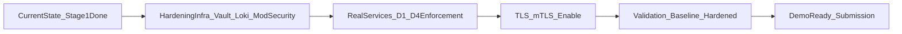

# Kế hoạch step-by-step (cầm tay chỉ việc, có đánh dấu tiến độ)

## 1) Trạng thái hiện tại (đã đối chiếu)

### Đã làm xong
- [x] Chốt scope D1-D4, owner, tiêu chí pass/fail trong [implementation/01-scope-kickoff.md](implementation/01-scope-kickoff.md).
- [x] Có board 13 ngày trong [implementation/02-day-by-day-board.md](implementation/02-day-by-day-board.md).
- [x] Có skeleton stack: Nginx + Kong + Keycloak + Prometheus + Grafana + app mock trong [core/docker-compose.yml](core/docker-compose.yml).
- [x] Có route gateway trong [core/kong/kong.yml](core/kong/kong.yml).
- [x] Có hướng dẫn chạy nhanh trong [core/README.md](core/README.md).
- [x] Có test script D1-D4 bản chạy được trong [security/run-security-checks.ps1](security/run-security-checks.ps1).
- [x] Có báo cáo baseline/hardened trong [metrics/g3-report.md](metrics/g3-report.md) và [metrics/g3-baseline-vs-hardened.csv](metrics/g3-baseline-vs-hardened.csv).

### Mới hoàn thành một phần
- [~] WAF: có Nginx edge, chưa có ModSecurity ruleset đầy đủ theo kiến trúc chuẩn.
- [~] Multi-node: mới tách theo network/service logic, chưa triển khai đa host vật lý.

### Chưa làm
- [ ] Vault OSS Transit + KV + rotation.
- [ ] Loki + pipeline log (gateway/services -> Loki -> Grafana).
- [ ] Service nghiệp vụ thật (hiện còn mock), nên D1-D4 chưa enforce đầy đủ bằng business code.
- [ ] TLS/mTLS end-to-end đúng chuẩn canonical.

## 2) Mục tiêu kế hoạch nâng cấp
- Từ trạng thái hiện tại lên mức bám kiến trúc chuẩn trong [docs/Kien-truc-he-thong-NT219.md](docs/Kien-truc-he-thong-NT219.md), ưu tiên 4 hạng mục còn thiếu: Vault, Loki, ModSecurity, service thật cho D1-D4.

## 3) Lộ trình thao tác chi tiết (step-by-step)

### Giai đoạn A - Củng cố hạ tầng bảo mật (ưu tiên cao)

#### A1. Thêm Vault vào stack
- [ ] Bước 1: Bổ sung service `vault` vào [core/docker-compose.yml](core/docker-compose.yml) (port nội bộ, volume dữ liệu).
- [ ] Bước 2: Tạo file cấu hình Vault trong `core/vault/` (dev mode cho lab trước, sau đó chuyển file config chuẩn).
- [ ] Bước 3: Khởi động stack và xác nhận Vault healthy.
- [ ] Bước 4: Tạo path KV cho secrets (`jwt`, `hmac`, `db-credentials`) và policy tối thiểu cho service.
- [ ] Bước 5: Cập nhật [core/README.md](core/README.md) thêm lệnh init/unseal (nếu không dùng dev mode).

#### A2. Thêm Loki + log pipeline
- [ ] Bước 1: Bổ sung service `loki` vào [core/docker-compose.yml](core/docker-compose.yml).
- [ ] Bước 2: Thêm `promtail` hoặc agent ship log từ Nginx/Kong/service.
- [ ] Bước 3: Cập nhật Grafana datasource trỏ Prometheus + Loki.
- [ ] Bước 4: Tạo dashboard cơ bản: `4xx/5xx`, failed auth, webhook reject.
- [ ] Bước 5: Cập nhật [core/observability/prometheus.yml](core/observability/prometheus.yml) nếu cần thêm metrics target liên quan.

#### A3. Nâng Nginx lên ModSecurity
- [ ] Bước 1: Đổi image Nginx sang image có ModSecurity/OWASP CRS.
- [ ] Bước 2: Thêm file rule trong `core/nginx/` (mode `DetectionOnly` trước).
- [ ] Bước 3: Chạy test D1-D4, ghi false positive.
- [ ] Bước 4: Chuyển sang block mode cho rule đã an toàn.
- [ ] Bước 5: Cập nhật tài liệu vận hành trong [security/README.md](security/README.md).

### Giai đoạn B - Thay mock bằng service thật

#### B1. Dựng service thật cho Order/User/Billing
- [ ] Bước 1: Tạo code service thật (ít nhất endpoint cần cho D1-D4).
- [ ] Bước 2: Kết nối DB Postgres riêng cho nghiệp vụ (không dùng echo server).
- [ ] Bước 3: Seed dữ liệu 2 tenant để test BOLA.
- [ ] Bước 4: Thay route Kong đang trỏ mock sang service thật trong [core/kong/kong.yml](core/kong/kong.yml).

#### B2. Enforce D1-D4 bằng code
- [ ] Bước 1: D1 - object-level authz theo `tenant_id` + ownership.
- [ ] Bước 2: D2 - refresh token rotation + denylist.
- [ ] Bước 3: D3 - verify HMAC + timestamp + nonce tại Billing ingress.
- [ ] Bước 4: D4 - allowlist URL + block metadata IP/private range.
- [ ] Bước 5: Đồng bộ test case trong [security/test-cases-d1-d4.md](security/test-cases-d1-d4.md).

### Giai đoạn C - Chuẩn hóa bảo mật kênh và kiểm chứng

#### C1. TLS/mTLS theo kiến trúc
- [ ] Bước 1: Tạo cert lab (CA nội bộ).
- [ ] Bước 2: Bật TLS client->edge và edge->gateway.
- [ ] Bước 3: Bật mTLS cho luồng S2S quan trọng (ít nhất Billing hoặc webhook ingress).
- [ ] Bước 4: Cập nhật tài liệu chứng minh G1 trong report.

#### C2. Chạy kiểm chứng và chốt bằng chứng
- [ ] Bước 1: Chạy baseline bằng [security/run-security-checks.ps1](security/run-security-checks.ps1).
- [ ] Bước 2: Chạy hardened và lưu kết quả vào [metrics/g3-baseline-vs-hardened.csv](metrics/g3-baseline-vs-hardened.csv).
- [ ] Bước 3: Cập nhật [metrics/g3-report.md](metrics/g3-report.md) với số liệu mới.
- [ ] Bước 4: Chốt artefact nộp theo [delivery/01-final-submission-checklist.md](delivery/01-final-submission-checklist.md).

## 4) Tiêu chí hoàn tất (Definition of Done phiên bản nâng cấp)
- [ ] Có Vault + Loki chạy ổn định trong compose.
- [ ] Có ModSecurity chạy block mode cho rule đã kiểm chứng.
- [ ] D1-D4 chạy trên service thật, không còn mock.
- [ ] Có số liệu baseline/hardened cập nhật mới, có log/screenshot minh chứng.
- [ ] Luồng demo 10 phút chạy được end-to-end theo [delivery/02-demo-runbook-10min.md](delivery/02-demo-runbook-10min.md).

## 5) Sơ đồ thực thi nhanh
